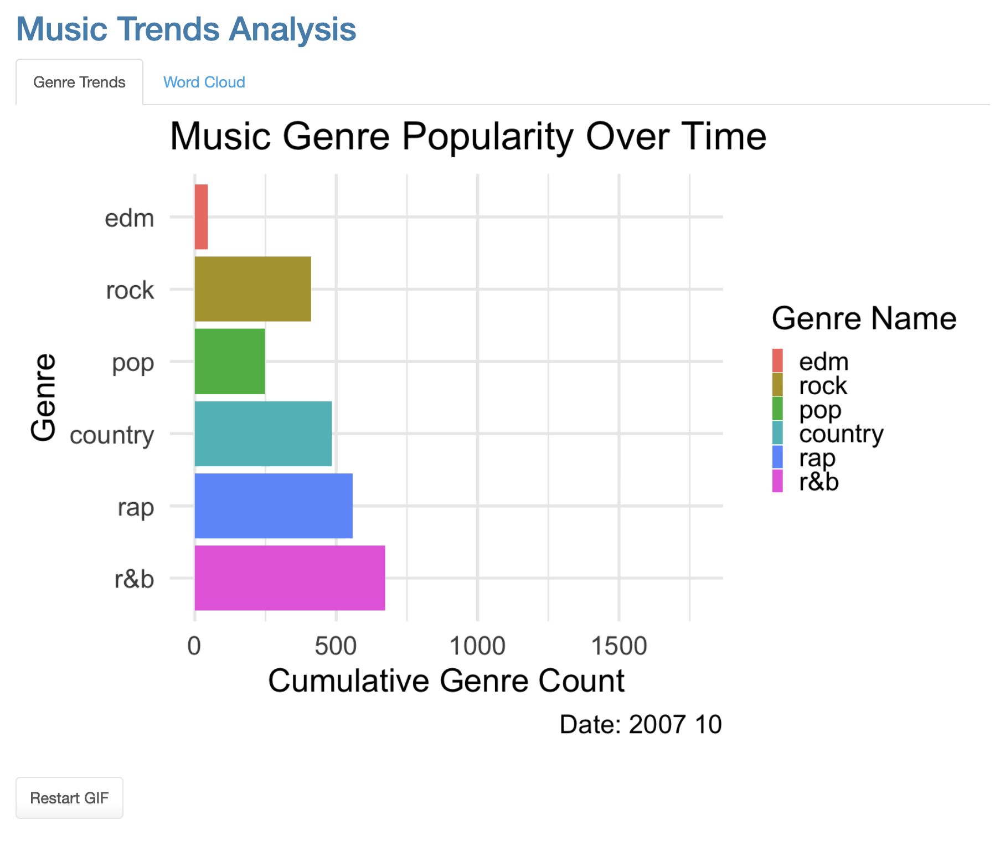
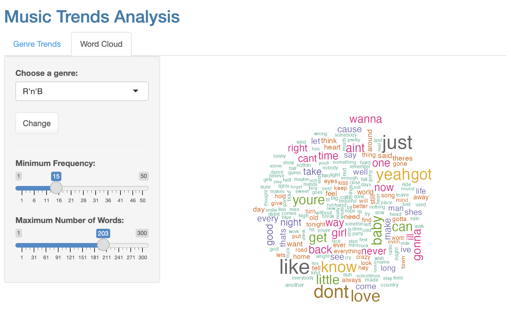

# Phukao Prommolmard

## CSC-324 Individual Project

Welcome to the interactive Music Trends Analysis app. This application is designed as an accessible platform for music enthusiasts, statisticians, and anyone with a keen interest in uncovering the evolvement and trends in music genres over time, as evidenced through Billboard chart data.

### Rationale

This project was initiated with the aim of offering insights into the dynamic world of music through a detailed analysis of genres and their popularity trends. Given the rich history of music and its impact on culture and society, a simple and straightforward tool was needed to explore these intricate dynamics. The Music Trends Analysis app serves as a basic resource for music enthusiasts and professionals alike to explore, analyze, and visualize the shifts in music preferences and the emergence of various genres over the years.

### How to Run the App

1.  Clone this repository to your local machine.
2.  Ensure you have R and RStudio installed. If not, download them from [CRAN](https://cran.r-project.org/).
3.  Open RStudio and set your working directory to the cloned repository's folder.
4.  Install the required libraries by running the command:

``` r
install.packages(c("shiny", "shinythemes", "tm", "wordcloud", "RColorBrewer", "memoise"))
```

5.  Open the 'genre-over-time.R' file in RStudio and run the app.

### What the App Does

The Music Trends Analysis app visualizes the progression of different music genres over time, as depicted by data from the Billboard charts. It features an animation that represents the genres' popularity trends and an interactive word cloud that displays common words associated with selected genres, allowing users to gain insights into the characteristics and lyrical themes that define each genre.

#### Features

-   **Genre Trends:** An animated GIF illustrating the progression of various music genres over time.

-   **Word Cloud:** A dynamic, interactive word cloud that visualizes the most frequent words associated with a selected genre. Users can adjust the number of words displayed and refresh the word cloud to explore different genres.

    

### Future Directions
I aim to enhance the app's functionality and user experience with the following features in the upcoming versions:

1.  **Extended Data Analysis:** Incorporate more granular data to offer detailed insights into sub-genres and their evolution.
2.  **User Interactivity:** Enhance user engagement by allowing users to upload their datasets for personalized analysis.
3.  **Machine Learning Integration:** Implement machine learning algorithms to predict future trends and popularity of various genres.
4.  **Enhanced Visualizations:** Improve and diversify the visual representation of data for more intuitive and insightful interpretations.

Feel free to explore the app and dive into the fascinating journey of music's evolution through the lenses of data and analysis. Your feedback and contributions are highly welcomed to enhance the application's features and usability.
