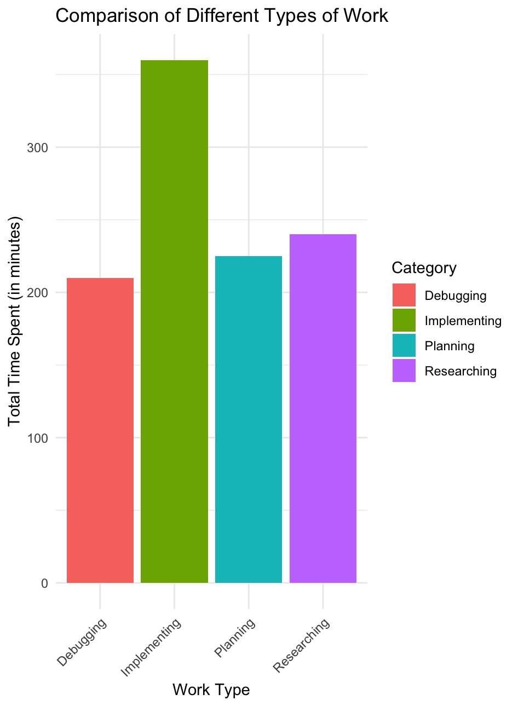
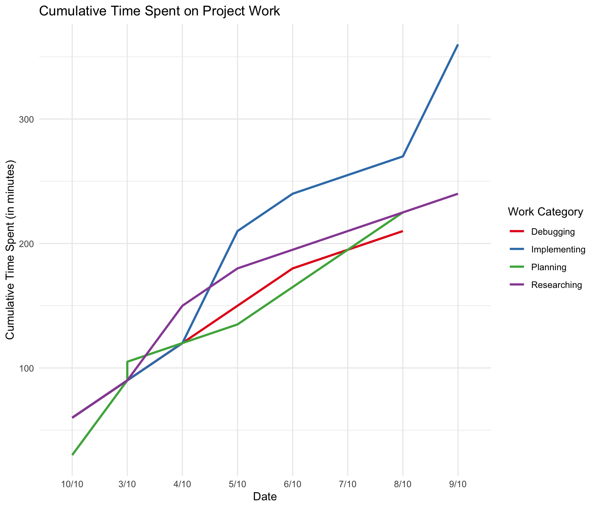
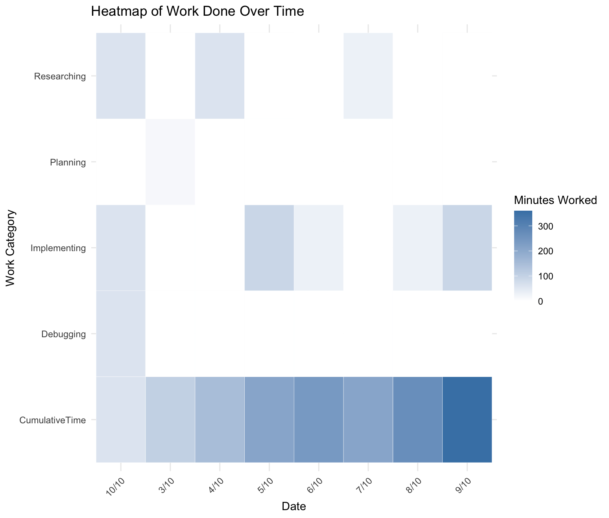

# Phukao Prommolmard
## CSC-324 Individual Project - Music Trends Analysis App

Welcome to the interactive Music Trends Analysis app, a tool designed to offer insights into the trends and evolution of music genres over time. 

### Project Purpose

This Shiny app is crafted to provide an intuitive and interactive experience for analyzing and visualizing music genre trends over the years, using data from the Billboard charts. It's a window into the musical landscape, offering insights into how different genres have risen or declined in popularity, painting a picture of our collective musical journey.

### [Video Presenting the app](https://youtu.be/hCgg7U46_PE)

### Features

-   **Genre Trends:** An animated GIF illustrating the progression of various music genres over time.


-   **Word Cloud:** A dynamic, interactive word cloud that visualizes the most frequent words associated with a selected genre. Users can adjust the number of words displayed and refresh the word cloud to explore different genres.


### Data Description and Collection

The data is sourced from [Kevin Schaich's Billboard Project](https://github.com/kevinschaich/billboard/tree/master), a comprehensive collection of chart data from Billboard's Hot 100 chart. The dataset includes various data points, such as song title, artist, position on the chart, and more. It offers a detailed account of music trends, painting a comprehensive picture of genre popularity over time.

### Intended Users

The Music Trends Analysis app is tailored for music enthusiasts, researchers, data scientists, and anyone interested in the intricate dance of musical genres' popularity over time. It's a bridge between raw data and insightful visualizations, making the exploration of music trends both intuitive and enlightening.

### Questions Addressed

- How have different music genres fluctuated in popularity over the years?
- What are the common lyrical themes associated with each genre, and how can they be visually represented?
- How can we make music genre trend analysis interactive and engaging for a diverse audience?

### Insights Gleaned

The app illuminates the dynamic nature of music genres, revealing patterns of rise, dominance, and decline. Users can visually trace the journey of different genres, gaining insights into cultural shifts and emerging musical themes. The word cloud offers a lyrical landscape, highlighting the words that define and characterize each genre.

### Wishlist for Improvement

- Integration of a broader dataset to include more genres and sub-genres for a more nuanced analysis.
- Enhanced interactivity to allow users to delve deeper into specific time frames or musical artists.
- Inclusion of machine learning algorithms for predictive analysis of future genre trends.

### Process and Development

The process and development of the Music Trends Analysis app was an intricate journey involving data cleaning, transformation, and visualization, all aimed at creating an insightful and interactive tool for users. Each step was backed by strategic use of R's rich ecosystem of packages and functions.

#### Data Cleaning and Transformation

The first crucial step was cleaning and transforming the raw data to make it suitable for analysis. I started with the billboard lyrics dataset, which was read into R using the `read.csv` function.

``` r
billboard <- read.csv("wordcloud/billboardlyrics.csv")
```

The **dplyr**, **stringr**, and **purrr** libraries played an integral role in the data cleaning process. The `dplyr` package facilitated data manipulation and transformation; `stringr` aided in string manipulation, and `purrr` was used for functional programming.

I was particularly interested in specific genres, thus filtered the data accordingly. I defined a vector with genres of interest and then applied a function to filter the dataframe based on these genres. This was achieved through the combination of the `filter` and `map_lgl` functions.

``` r
genres_of_interest <- c('rock')
filtered_df <- billboard %>% 
               filter(map_lgl(genre, is_genre_of_interest, genres_of_interest = genres_of_interest))
```

Post filtering, we cleaned the lyrics data by replacing all non-graph characters with space, ensuring a clean and structured format of the lyrical content.

``` r
filtered_df$lyrics <- str_replace_all(filtered_df$lyrics, "[^[:graph:]]", " ")
```

Finally, the cleaned lyrics associated with the selected genre were written to a text file using the `write.table` function, which would later be utilized for word cloud generation.

``` r
write.table(filtered_df$lyrics, "wordcloud/rockLyrics.txt", row.names = FALSE, col.names = FALSE, quote = FALSE, sep = "\t")
```

#### Visualization and Interactivity

I leveraged packages like **tm**, **wordcloud**, **RColorBrewer**, **shiny**, and **shinythemes** to create an interactive and aesthetically pleasing user interface. The **tm** package was pivotal in text mining, while **wordcloud** and **RColorBrewer** enhanced the visualization aspects.

#### Caching and Optimization

Performance optimization was addressed by employing the **memoise** package, which facilitated the caching of computation results to boost the app's responsiveness.

### Work Log

My worklog is stored in a .csv file in work-log folder. I've visualized my work in 3 interesting ways:

It looks like I've spent the most time implementing. This makes a lot of sense since I could be spent the whole hour trying to animate the bar graph. Researching coming up as second also makes a lot of sense since I had to learned how to implement javaScript into my code.


This one is a timeline of my project, where you can see I started doing a lot of implementing towards the middle, then spend time researching, then goes back in implementing.


This heatmap definitely shows ab alternative look at what work is put into a given day. I definitely logged "debugging" during implementation as just implementation. You can also see how a period of implementation only starts after a period of researching.


Finally, just a direct number of minutes spent on something.
```
> cat("Most time spent on:", workSummary$Category[1], "with", workSummary$TotalTime[1], "minutes.\n")
Most time spent on: Implementing with 360 minutes.
> cat("Least time spent on:", workSummary$Category[nrow(workSummary)], "with", workSummary$TotalTime[nrow(workSummary)], "minutes.")
Least time spent on: Debugging with 210 minutes.
```

### Reflection

The integration of various R packages and a meticulous data cleaning process facilitated the creation of an intuitive and engaging app. Users can delve into a rich, interactive exploration of music trends, backed by clean, structured, and well-presented data. Future enhancements will focus on diversifying data sources, improving visualization, and expanding interactivity to cater to a broader audience and provide more profound insights into the world of music.


### Design Decisions

The app employs a what-why-how framework, focusing on offering users (what) an interactive experience to explore (why) music genre trends through visualizations (how). Encodings, such as animated GIFs for genre trends and interactive word clouds for lyrical themes, were chosen for their intuitive and engaging nature.

### Sources and Credits

Data Source: [Kevin Schaich's Billboard Project](https://github.com/kevinschaich/billboard/tree/master)

Feel free to explore the app and immerse yourself in the mesmerizing world of music trends analysis. Your insights, feedback, and contributions are highly valued as we seek to refine and enhance this tool for a richer musical exploration journey.
